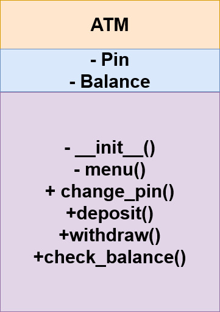
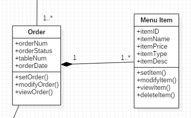
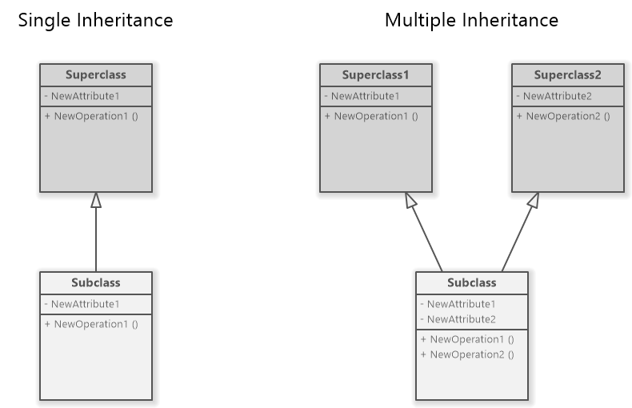

# OOP-Cheatsheet
## Core Concept of OOP
Lets talk about what is  `OOP` in a layman language.

Imagine you're building a virtual world, like a video game or a simulation. In this world, everything can be thought of as objects. Objects are like characters or things that have characteristics (attributes) and can do things (methods).

**Class:** Class is a blueprint like how an object will behave.
**Objects:** These are the main entities in your virtual world. For example, if you're creating a game, an object could be a player, an enemy, or a weapon.Objects are mutable like list,dict and sets cause it works like value by reference like it stores the data in a same location.

**Attributes:** These are the characteristics or properties of the objects. For a player object, attributes might include the player's name, health, and score.

**Methods:** These are the actions or behaviors that objects can perform. In a game, a player object might have methods like "move," "attack," or "collect items."

**Encapsulation:** This is like putting things in a box. It means that an object keeps its attributes and methods together, and the outside world doesn't need to know all the details. For example, when you play a game, you don't need to know how the player's health is calculated; you just see the current health value.

**Inheritance:** This is like passing down traits in a family. One object can inherit attributes and methods from another object. For instance, if you have a general "character" object, a "player" object could inherit from it and add specific player-related features.

**Polymorphism:** This is like using the same word in different contexts. It allows different objects to be treated as instances of the same type. For example, both a player and an enemy might have a "damage" method, but they would behave differently.<br/>


## Break Down Each of the concepts with code and example 
### Function vs Method: 
## Functions

- **Definition:** A function is a standalone block of code that performs a specific task. It is defined outside of any class or object.

- **Usage:** Functions can be called from anywhere in the code, as long as they are in the same scope or imported.

- **Example:**

    ```python
    def add_numbers(a, b):
        return a + b

    result = add_numbers(5, 7)
    ```

## Methods

- **Definition:** A method is a function associated with an object. It is defined within a class and is called on instances of that class.

- **Usage:** Methods are called on objects and operate on the data within those objects.

- **Example:**

    ```python
    class Calculator:
        def add_numbers(self, a, b):
            return a + b

    calc = Calculator()
    result = calc.add_numbers(5, 7)
    ```
- **Short Note:** lets we have a list l and we want to find out length of this list.so we will write len(l) , but if we append something in a list we will write l.append(). cause len is a function and append, copy, pop,remove etc are a method of a list class.    

## Constructor

A constructor is like a setup wizard for objects in programming. It's a special method, often named `__init__`, that runs automatically when  create an object. Its main job is to initialize the object's attributes or perform any necessary setup.
In Python:

```python
class MyClass  
    def __init__(self, initial_pin, initial_balance): 
    # this is constructor
     self.pin = initial_pin # instance variable 
    #  we call it instance variable cause we write it within the constructor and value will be different for each object 
     self.balance = initial_balance # instance variable
    
my_object = MyClass("1234", 1000)

```
- **Short Note:** 
- we usually write any sort of configuration related task in the constructor like database connectivity, hardware connectivity etc.
so basically we dont want to give specific control to the user and that time we will use constructor.<br/>

- Inside Class only two things are possible one is data and other one is method. Only object of this class can access that data and method even one method can't access another method and its datas within the class. if one method is trying to access another method we need and object and as `self` is the current object so we can access if we use self and thats why we use `self`.

## Simple Implementation based on `class`,`constructor`,`method` and `object`
 Now let's write a code  to understand oop better based on atm system 

 ```python 
  class Atm:
    def __init__(self) : 
        # Constructor
        self.pin= ""
        self.balance=0 
        self.menu() #we can access menu method property cause we use self
        

    def menu(self):
        # method
        user_input= input(""" 
                         Hello, How would you like to proceed
                          1.Enter 1 to create pin
                          2.Enter 2 to deposit
                          3.Enter 3 to Withdraw
                          4.Enter 4 to check balance
                          5.Enter 5 to exit

                         """)
        if user_input=="1":
         self.create_pin()
        elif user_input=="2":
           self.deposit()
        elif user_input=="3":
           self.withdraw()
        elif user_input=="4":
           self.check_balance() 
        else:
           print("Bye")          
        
    # methods
    def create_pin(self):
       self.pin=input("Enter your pin : ")
       print("Pin set sucessfully")

    def deposit(self):
       temp=input("Enter your pin : ")
       if temp==self.pin:
          amount=int(input("Enter the amount : "))
          self.balance=self.balance+amount
          print("Deposit Sucessfully")
       else:
          print("Invalid pin")   

    def withdraw(self):
       temp=input("Enter your pin : ")
       if temp==self.pin:
          amount=int(input("Enter the amount : "))
          if amount<self.balance:
             self.balance=self.balance-amount
             print("operation sucessfull")
          else:
             print("Insufficient Funds") 
       else:
          print("Invalid Pin : ")  
          
    def check_balance(self):
       temp=input("Enter your pin : ")
       if temp==self.pin:
          print(self.balance)
       else:
          print("invalid pin")  
# Object creation name bank based on the class Atm
  bank=Atm()
 ```

 ### Encapsulation
 Usually object can access everything like datas and methods so anyone can change the data so good practise is to hide the data.In pyhton we use `__` to hide the data and method. but fun fact is in python nothing is truely private. anyone can access the private data using class name and that data_name. lets give an example. lets we have a class name `Atm` and private data name `__balance` and object name `value`. now we can access that private data using `value._Atm__balance`. whatever in conventional method we use `getter` and `setter` emthod to access the data.
 Let's implement the encapsulation concept on our previous code.
 ```python
 
  # We will build a real life project to understand oop better based on the atm transaction
  #  
class Atm:
    def __init__(self) :
        self.__pin= ""  # hide the data using `__` so that user can't see that data
        self.__balance=0
        self.__menu()

     # we use getter and setter method to access the private data
    def get_pin(self):     
       return self.__pin

    def set_pin(self,new_pin):
       if type(new_pin)==str:
          
          self.__pin=new_pin
          print("print changed")
       else: 
          print("not allowed")      
        

    def __menu(self):  # we can also hide the method also 
        user_input= input(""" 
                         Hello, How would you like to proceed
                          1.Enter 1 to create pin
                          2.Enter 2 to deposit
                          3.Enter 3 to Withdraw
                          4.Enter 4 to check balance
                          5.Enter 5 to exit

                         """)
        if user_input=="1":
         self.create_pin()
        elif user_input=="2":
           self.deposit()
        elif user_input=="3":
           self.withdraw()
        elif user_input=="4":
           self.check_balance() 
        else:
           print("Bye")          
        

    def create_pin(self):
       self.__pin=input("Enter your pin : ")
       print("Pin set sucessfully")

    def deposit(self):
       temp=input("Enter your pin : ")
       if temp==self.__pin:
          amount=int(input("Enter the amount : "))
          self.__balance=self.__balance+amount
          print("Deposit Sucessfully")
       else:
          print("Invalid pin")   

    def withdraw(self):
       temp=input("Enter your pin : ")
       if temp==self.__pin:
          amount=int(input("Enter the amount : "))
          if amount<self.__balance:
             self.__balance=self.__balance-amount
             print("operation sucessfull")
          else:
             print("Insufficient Funds") 
       else:
          print("Invalid Pin : ")  
          
    def check_balance(self):
       temp=input("Enter your pin : ")
       if temp==self.__pin:
          print(self.__balance)
       else:
          print("invalid pin")  


 ```
 This is the class diagram :
       

 ## Collection of Objects

 we can keep the objects as a list, dict

 ```python
  class Customer:
    def __init__(self,name,age):
        self.name=name
        self.age=age

c1=Customer("niloy",26)
c2=Customer("nayan",27)
c3=Customer("piyas",30)

L=[c1,c2,c3] # pass the objects in a list
for i in L:
    print(i.name,i.age)
 
 ```

 ## Variables
 **Instance Variable:** 
    we write instance variable within the constructor and value will be different for each objects.
  **Static/Class Variable:**
     The value of a variable will be same for each objects. like if we want to store `IFSC` code and as `IFSC` code same for a branch so take it as a static variable. 

   ```python
      class Atm:

    __counter=1 # Static/Class varible

    def __init__(self) :
        self.__pin= ""   #instance variable 
        self.__balance=0 # instance variable
        self.serialno=Atm.__counter # to access static variable we write class name.static variable like Atm.counter
        Atm.__counter=Atm.__counter+1

                      
                    
    @staticmethod    
    def get_counter(): 
        return Atm.__counter  #for static variable we dont need to use `self`. as we use this getter and setter method access the static variable so we dont need to use self 


    def set_counter(new):
       if type(new)==int:
          Atm.__counter=new
       else:
          print("Not Allowed")      

        

   
    def get_pin(self):     
       return self.__pin

    def set_pin(self,new_pin):
       if type(new_pin)==str:
          
          self.__pin=new_pin
          print("print changed")
       else: 
          print("not allowed")      
        
     
   ```
## Relationship
**Aggregation:**
It is also called `Has-A relationship`. Like if we have two class name customer and address and customer is trying to access address so this is `Has-A relationship`.we use `diamond` sign to indicate aggregation in class diagram.<br/>
  

```python
 class Customer:
    def __init__(self,name,gender,address):
        self.name=name
        self.gender=gender
        self.address=address


    def edit_profile(self,new_name,new_city,new_pin,new_state):
        self.name=new_name
        self.address.change_address(new_city,new_pin,new_state)    #aggregation

class Address:
    def __init__(self, city,pincode,state):
        self.city=city
        self.pincode=pincode
        self.state=state

    def change_address(self,new_city,new_pin, new_state):
        self.city=new_city
        self.pincode=new_pin
        self.state=new_state    

add=Address("Comilla",3519, "Chittagong")
cust=Customer("Niloy","Male",add)   #when we give address of a customer we pass Address class object `add`

cust.edit_profile("Nayan","Dhaka",3510,"manik")
print(cust.address.city)             

```

**Polymorphism:**
It is also called `Is-A relationship`.Inheritance is a fundamental concept in object-oriented programming, allowing a new class to inherit the properties and behaviors of an existing class.In inheritance child class can inherit parent class property but parent class can't inherit child class property.we usually inherit `datamembers`, `method` and `constructor` but we are not allowed to inherit `private datamember`.  
 

**Short Note:**
If we have two class and if parent class has constructor and child class one doesn't have any constructor but we create an object of child class that time parent class constructor will be called.

```python
# Base class User
class User:
    def __init__(self, username, email):
        self.username = username
        self.email = email

    def login(self):
        print(f"{self.username} is logging in")

    def register(self):
        print(f"{self.username} is registering")

# Base class Student
class Student:
    def __init__(self, student_id, courses):
        self.student_id = student_id
        self.courses = courses

    def enroll(self):
        print(f"Student {self.student_id} is enrolling in courses")

    def review(self):
        print(f"Student {self.student_id} is reviewing courses")

# Derived class StudentUser inheriting from both User and Student
class StudentUser(User, Student):
    def __init__(self, username, email, student_id, courses):
        # Calling the constructors of both base classes
        User.__init__(self, username, email)
        Student.__init__(self, student_id, courses)

# Creating an instance of the derived class
student_user = StudentUser("niloy islam", "niloy@gmail.com", "S12345", ["Math", "Physics"])

# Accessing methods from both base classes
student_user.login()    
student_user.enroll()   


```

- Types of Inheritance:
 


**Polymorphism**

Polymorphism is the ability of a class to take on multiple forms, where an object can represent different types or have different behaviors based on the context. There are two types of polymorphism 

- Method Overloading:
Method overloading is the ability to define multiple methods in the same class with the same name but with a different number or type of parameters.
```python
class Calculator:
    def add(self, a, b):
        return a + b

    def add(self, a, b, c):
        return a + b + c

calc = Calculator()

print(calc.add(1, 2))     # Raises an error as there is no add method with two parameters
print(calc.add(1, 2, 3))  # Outputs: 6

```
 method overloading is attempted in the Calculator class, but it's not directly supported in Python like in some other languages. In Python, when you define multiple methods with the same name in a class, the last one defined will override the previous ones.

 - Method Overridning: 
 Method overriding occurs when a subclass provides a specific implementation for a method that is already defined in its superclass.

 ```python
 class Phone:
    def __init__(self,price,brand, camera):
        print("Inside the constructor")
        self.price=price
        self.brand=brand
        self.camera=camera

    def buy(self):
        print("Buying a phone")

class SmartPhone(Phone):


    def buy(self):
        print("Buying smartphone")

s=SmartPhone(17200,"REDMI Note 10S", 64) # Phone class constructor will be called as SmartPhone doesn't have constructor
print(s.price,s.brand,s.camera)

s.buy() # SmartPhone method buy will be called not Phone class method cause we create an object of SmartPhone. 


 
 ```


**Super() keyword:**


      
